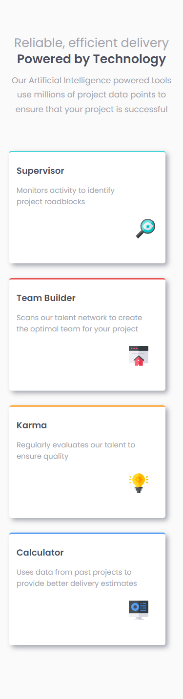
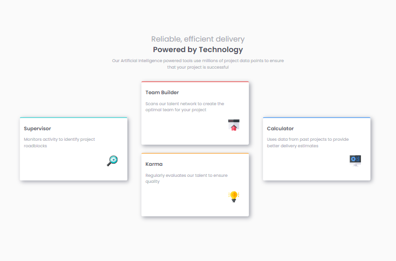

# Frontend Mentor - Four card feature section solution

This is a solution to the [Four card feature section challenge on Frontend Mentor](https://www.frontendmentor.io/challenges/four-card-feature-section-weK1eFYK). Frontend Mentor challenges help you improve your coding skills by building realistic projects. 

## Table of contents

- [Overview](#overview)
  - [Screenshot](#screenshot)
  - [Links](#links)
- [My process](#my-process)
  - [Built with](#built-with)
  - [What I learned](#what-i-learned)
  - [Continued development](#continued-development)
  - [Useful resources](#useful-resources)
- [Author](#author)
- [Acknowledgments](#acknowledgments)

**Note: Delete this note and update the table of contents based on what sections you keep.**

## Overview


### Screenshot




## Mobile-view


## Desktop-view
### Links

- Solution URL: [4-card-feautures](https://github.com/Ezekiel-Great/4-card-feautures/tree/main)
- Live Site URL: [Add live site URL here](https://your-live-site-url.com)

## My process

### Built with

- Semantic HTML5 markup
- CSS custom properties
- Flexbox
- CSS Grid

### What I learned
#### I learnt to use grid

```css
  .container .content {
    display: grid;
    grid-template-columns:repeat(3, 1fr);
    gap: 30px;
  }
```


## Author


- Frontend Mentor - [@Ezekiel-Great](https://www.frontendmentor.io/profile/Ezekiel-Great)
- Twitter - [@yeshua_codeit](https://www.twitter.com/yeshua_codeit)


## Acknowledgments
